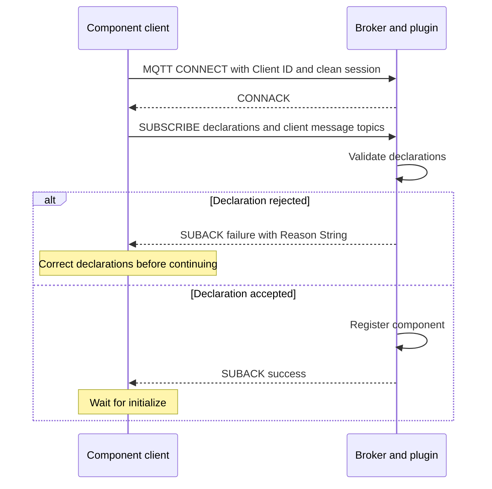
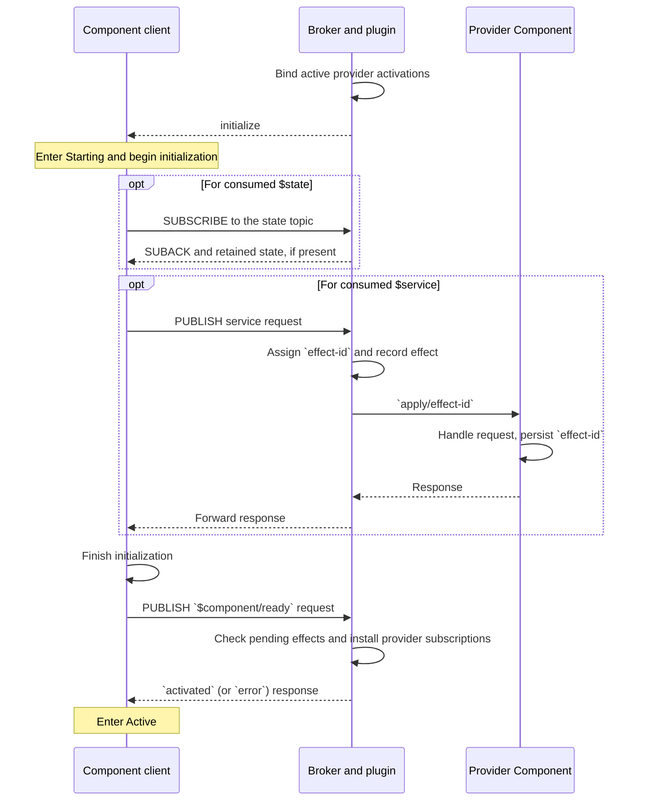
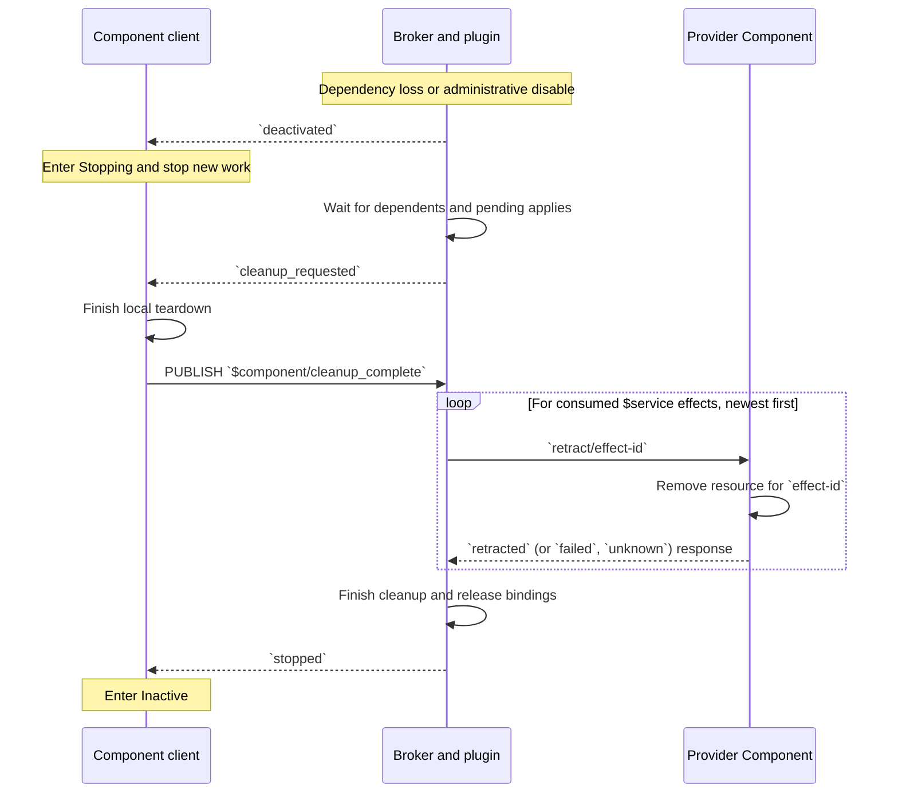
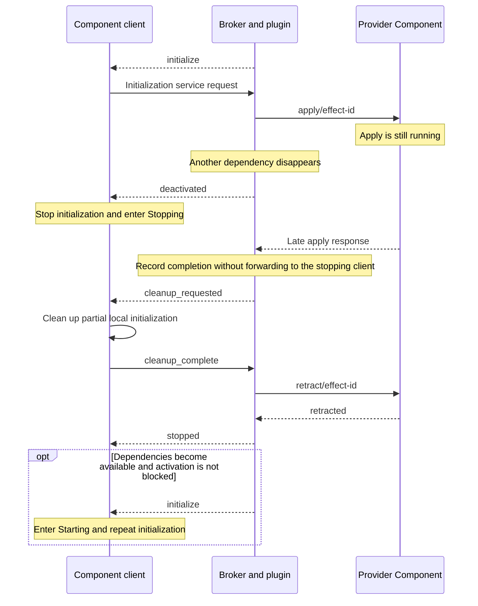
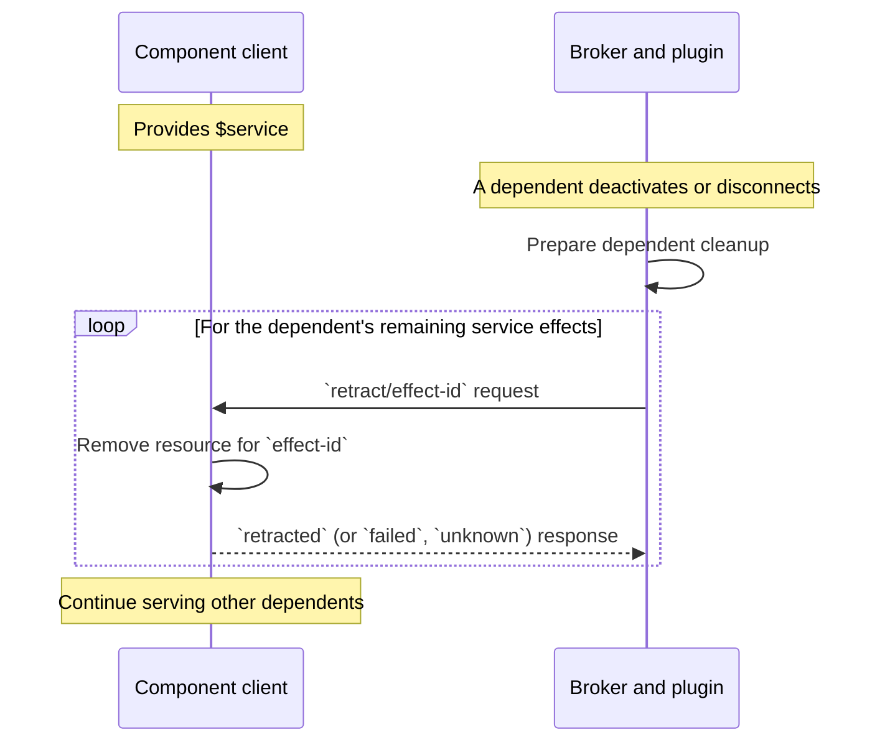

# Component client lifecycle flows

This document describes how to implement an MQTT client that represents a
component in this plugin. It covers the current PoC protocol.

A component can consume resources, provide resources, or do both. A Provider
Component supplies a resource that this component consumes. A dependent consumes a resource
that this component provides.

## Messages and client states

Use MQTT 5 with a clean session. Install message handlers before sending resource
declarations. Keep lifecycle handling available while asynchronous work runs.

The component has four lifecycle states while connected:

| State | Client behavior |
| --- | --- |
| Inactive | Wait for `initialize`. Do not use managed resources. |
| Starting | Initialize against the assigned Provider Components. Send `ready` after initialization succeeds. |
| Active | Perform application work and serve provided resources. |
| Stopping | Stop new work. Preserve resources for accepted operations and dependent cleanup. Wait for permission to perform local teardown. |

Connection and activation are separate. A connected component can remain Inactive
until its dependencies become available. One connection can have many activations.

Listen on `$component/<clientid>/events`. The plugin installs this subscription
when it accepts declarations. A client can also include it explicitly in its
declaration SUBSCRIBE packet.

There are two lifecycle message formats:

| Format | Messages |
| --- | --- |
| JSON payload, such as `{"event":"initialize"}` | `initialize`, `deactivated`, `cleanup_requested` |
| MQTT User Property `component-status`, with an empty payload | `activated`, `stopped`, `aborted`, `retry_accepted`, `error` |

Errors also carry `component-reason`. A response to a request uses its MQTT
Response Topic if supplied. Otherwise, it uses the lifecycle topic. Correlation
Data is copied to the response. Subscribe to any application response topic
before issuing requests.

The diagrams label lifecycle messages by event or status. They omit MQTT
PUBACK packets. PUBACK confirms transport, not successful component processing.

## 1. Connect and declare resources

1. Connect with the component's MQTT Client ID.
2. Send one SUBSCRIBE packet containing all resource declarations.
3. Include lifecycle, application-command, and response subscriptions as needed.
4. Check SUBACK reason codes. Rejected declarations return `0x83`
   (Implementation specific error) and an MQTT 5 Reason String.
5. Wait for `initialize`. Do not start managed operations merely because SUBACK
   arrived.

For example, a switch declares:

```text
$provide/service/room/register-lamp
$consume/state/room/occupancy
$component/room-switch/events
demo/room-switch/commands/+
demo/room-switch/replies
```

Use ordinary topics for application traffic. Reserve `$component/...`,
`$component-admin/...`, `$service/...`, and `$state/...` for the plugin protocol.



A successful declaration SUBACK confirms acceptance, not activation. Declaration
rejection does not send a separate lifecycle error. Lifecycle delivery and SUBACK
can interleave. Do not require SUBACK to arrive before handling `initialize`.

Declarations remain fixed for the connection. Reconnect to change them. A
`$consume/state/...` declaration does not subscribe to its `$state/...` topic.
Send that subscription during initialization. Do not include it in the initial
packet while dependencies might still be unavailable.

## 2. Activate

On `initialize`, enter Starting and begin initialization.

During initialization:

- Subscribe to exact consumed `$state/...` topics. Wait for the values your
  application needs. Retained state requires the broker's retainer.
- Publish initial provided state with RETAIN set. Request a response and check
  `state_written` when initialization requires confirmation.
- Call required services through their declared `$service/...` topics.
- Check application results. The plugin records any service response as apply
  completion; it does not decide whether the result is acceptable to your client.
- Prepare handlers for the services you provide before sending `ready`.

For a service request, set MQTT Response Topic and optionally Correlation Data.
The Provider Component receives the request on `$service/<key>/apply/<effect-id>`. It
records its resource under that effect ID and replies to the supplied Response
Topic. The plugin forwards the response and includes `component-effect-id`.



Send `ready` without RETAIN. Wait for `activated` before treating the component
as Active. The plugin rejects readiness while managed initialization work is
pending. Provider subscription installation can also fail. Handle these errors
without marking the component Active.

While Active, receive provided-service apply and retract requests through the
subscriptions installed by the plugin. Keep these handlers available during
Stopping. Ordinary application messages are not lifecycle-gated by the plugin;
enforce the component's state in your own application handlers.

## 3. Deactivate and clean up

Deactivation can follow dependency loss, administrative disablement, or an
initialization abort. A connected client receives `deactivated`.

On `deactivated`:

1. Enter Stopping. Stop initialization if it is in progress.
2. Stop starting new application work or managed operations.
3. Put the device into its required inactive behavior. For example, turn a lamp off.
4. Preserve resources needed by already accepted operations and retractions.
5. Keep the MQTT connection open and wait for `cleanup_requested`.

Do not destroy provided resources on `deactivated`. Dependents may still need
them to retract their effects.



The diagram shows service effects. The broker also removes tracked state
subscriptions and deletes provided retained state as part of managed cleanup.

On `cleanup_requested`, perform local teardown and then publish
`$component/cleanup_complete` without RETAIN after local teardown finishes.
The plugin rejects an early `cleanup_complete`.

The two notifications have different meanings:

| Notification | What the client may do |
| --- | --- |
| `deactivated` | Stop new work, but preserve resources needed for cleanup. |
| `cleanup_requested` | Tear down local resources. Dependents no longer need them. |

The broker retains your dependency bindings until managed cleanup finishes.
It uses them to send recorded retractions to the original provider activations.
The current plugin rejects new ordinary managed service calls and state writes
while Stopping. Design local teardown around local work and recorded inverses.

After `stopped`, remain connected to allow reactivation. Dependency recovery can
trigger a new `initialize` automatically. Administrative disablement blocks
reactivation until administrative enablement clears it.

## 4. Divert an unfinished initialization into cleanup

Divert means that initialization becomes invalid before activation completes.
It is not a separate MQTT event or command. The client receives `deactivated`
while Starting and follows the same cleanup protocol as an Active component.

For example, a component calls two Provider Components during initialization.
One disappears while an apply request to the other is still pending.



The `deactivated` message tells the client to stop initialization and follow
the cleanup flow. Once the owner is Stopping, the plugin records late apply
responses but does not forward them to that owner.

The broker does not cancel an accepted remote apply. It waits for reachable
pending applies to finish and then retracts their effects.

### Client-initiated initialization failure

When local initialization fails while Starting, publish `$component/abort`
without RETAIN. Its optional payload records an application-defined reason.
The broker sends `deactivated` and performs the same cleanup sequence.
The final response is `aborted`, rather than `stopped`.

After `aborted`, wait in Inactive. Dependency recovery alone does not restart an
aborted component. Publish `$component/retry` to clear the abort block. The broker
returns `retry_accepted` and sends `initialize` when dependencies are available.
Administrative enablement can also clear the abort block. Retry does not clear
an administrative disable block.

## 5. Handle deactivation or loss of a dependent

When a dependent deactivates or disconnects, this component receives retraction
requests for that dependent's service effects. Losing a dependent does not
deactivate this component. It continues serving other dependents.



Use the effect ID to identify the resource created by the earlier apply request.
Reply to the request's MQTT Response Topic. Set `component-status` to `retracted`
after removing the resource, or to `failed` or `unknown` if removal cannot be
confirmed. Preserve resources belonging to other effects.

The broker waits for accepted applies to complete before retracting their
effects. For a connected dependent, it also waits for that dependent's local
cleanup. A disconnected dependent cannot perform the local-cleanup handshake.

If this component is also Stopping, continue handling these retractions while
waiting for its own `cleanup_requested` notification.

## Connection loss and incomplete cleanup

An MQTT disconnect is not an orderly local-cleanup handshake. If your connection
closes, the broker cannot request or confirm your local teardown. It still stops
dependents and retracts your recorded effects through reachable Provider Components.

For an orderly shutdown, administratively disable the component, continue serving
cleanup, wait for `stopped`, and then disconnect. For example, publish
`{"clientid":"room-switch"}` to `$component-admin/disable`. The caller needs
broker authorization for that topic.

If a Provider Component disconnects, its outstanding service retractions have an `unknown`
outcome. A replacement Provider Component does not receive the old activation's retractions.
A reachable Provider Component can also report `failed` or `unknown`. These outcomes let
lifecycle cleanup finish, but they do not confirm that the external effect was
removed. The broker keeps the outcomes in its in-memory cleanup reports.

There is no general apply or retract timeout in this PoC. A connected Provider Component
that never responds can block cleanup. A connected component that never sends
`cleanup_complete` can also block cleanup of its Provider Components.

See [readme.md](readme.md#protocol) for the topic and property reference, and
[conformance.md](conformance.md) for the comparison with the EIP and paper.
